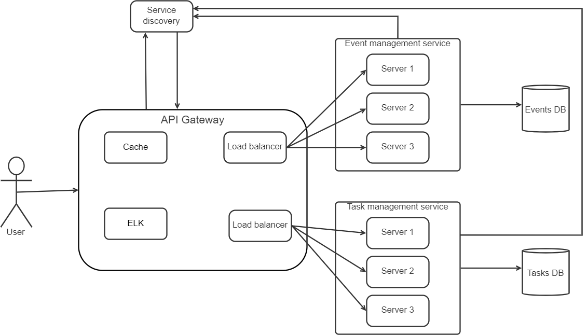

# PAD-project: Event planning application

## 1. Application suitability
 The event planning system is suitable for a microservices architecture because it involves various components, such as user management, event creation, guest invitations, task management, and more, which can be developed and maintained independently. As mentioned, distributed systems allow to scale specific components of the application independently. For example, during a popular event, it’s possible to scale the invitation management service to handle a large number of guest responses without affecting other parts of the application. This ensures that the application remains responsive even during peak usage

### Real world examples
* **WeddingWire:** WeddingWire is an event planning application specifically tailored for weddings. It provides tools for couples to plan their weddings, including finding vendors, managing guest lists, and creating wedding websites.
* **Meetup:** Meetup is a social platform that facilitates event planning and attendance. Users can create and join local interest-based groups and events. It's commonly used for organizing networking events, hobbyist meetups, and community gatherings.

 ## 2. Service boundaries
* **Event management service:** 
  * Create event
  * Update event details
  * Read event by Id
  * Read all events
  * Delete event.

* **Task management service:**
  * Create task
  * Update task
  * Read task by Id
  * Read all tasks assigned to an event
  * Delete task

## 3. System design diagram


## 4. Technology stack

**.NET for microservices:** .NET is a strong choice for building microservices due to its comprehensive ecosystem, cross-platform compatibility, performance, developer productivity, and security features. It supports multiple programming languages, offers scalability, and integrates well with other technologies and containerization, making it well-suited for modern microservices architectures.

**MSSQL Database for microservices:** MSSQL provides seamless integration with the .NET ecosystem, high performance, robust security features, and reliability. MSSQL is well-supported by Microsoft's development tools and offers compatibility with industry standards, making it a strong choice for building database-driven applications in the .NET framework.

**Java for API gateway:** Java is a favorable choice for implementing an API gateway due to its maturity (well-established, reliable, and proven over time), scalability, rich ecosystem, and strong security features. Its cross-platform compatibility, community support, and integration capabilities make it a reliable and customizable solution for managing, securing, and routing API requests in a microservices architecture.

## 5. Data management

   ### I.	 Creation and managing events service:
* Create Event:
```
Endpoint: POST /api/events
Request Payload: {
   "eventId" : "integer",
   "eventName": "string",
   "date" : "string",
   "location" : "string"
   "dessCode" : "string"
}
Response (Successful): HTTP status code 201 
Response (Unsuccessful): HTTP status code 400
```

* Update Event Details:
```
Endpoint: PUT /api/events/{eventId}
Request Parameters: {
   "eventId": "integer"
}
Request Payload: {
   "eventName": "string",
   "date" : "string",
   "location" : "string"
   "dessCode" : "string"
}
Response (Successful): HTTP status code 200 with a JSON response containing event details.
Response (Unsuccessful): HTTP status code 404 or 400
```

* Read event by Id:
```
Endpoint: GET /api/events/{eventId}
Request Parameters: {
   "eventId": "integer"
}
Response (Event Found): HTTP status code 200 with a JSON response containing event details.
Response (Event Not Found): HTTP status code 404

```

* Read all events:
```
Endpoint: GET /api/events
Response: HTTP status code 200 with a JSON response containing a list of events, each represented as an object with details such as event name, description, date, location, and dress code.


```
* Delete Event:
```
Endpoint: DELETE /api/events/{eventId}
Request Parameters: {
   "eventId": "integer"
}
Response (Successful): HTTP status code 204
Response (Unsuccessful): HTTP status code 404
```
### II. Creation and managing tasks service

* Create task: 
```
Endpoint: POST /api/tasks
Request Payload: {
   "taskId" : "integer",
   "eventId" : "integer",
   "taskName": "string",
   "taskDescription": "string",
   "deadline": "string",
   "status": "string ('done' / 'to do')"
}
Response (Successful): HTTP status code 201 
Response (Unsuccessful): HTTP status code 400

```
* Update task : 
```
Endpoint: PUT /api/tasks/{taskId}
Request Parameters: {
   "taskId": "integer"
}
Request Payload: {
   "eventId" : "integer",
   "taskName": "string",
   "taskDescription": "string",
   "deadline": "string",
   "status": "string ('done' / 'to do')"
}
Response (Successful): HTTP status code 200 with a JSON response containing task details.
Response (Unsuccessful): HTTP status code 404 or 400

```

* Read task by Id:
```
Endpoint: GET /api/tasks/{taskId}
Request Parameters: {
   "taskId": "integer"
}
Response (Task Found): HTTP status code 200 with a JSON response containing task details.
Response (Task Not Found): HTTP status code 404

```

* Read all tasks assigned to an event:
```
Endpoint: GET /api/tasks
Request Parameters: {
   "eventId": "integer"
}
Response(eventId Found): HTTP status code 200 with a JSON response containing a list of tasks.
Response (eventId Not Found): HTTP status code 404
```

* Delete task:

```
Endpoint: DELETE /api/tasks/{taskId}
Request Parameters: {
   "taskId": "integer"
}
Response (Successful): HTTP status code 204
Response (Unsuccessful): HTTP status code 404

```

## 6. Deployment and scaling
**Docker** is valuable for deployment and scaling due to its containerization technology, providing isolation, portability, and consistency. It enables efficient resource utilization and seamless horizontal scaling using container orchestration tools. Docker's version control, dependency management, and security features further streamline the deployment process, making it a popular choice for modern application development and operations.